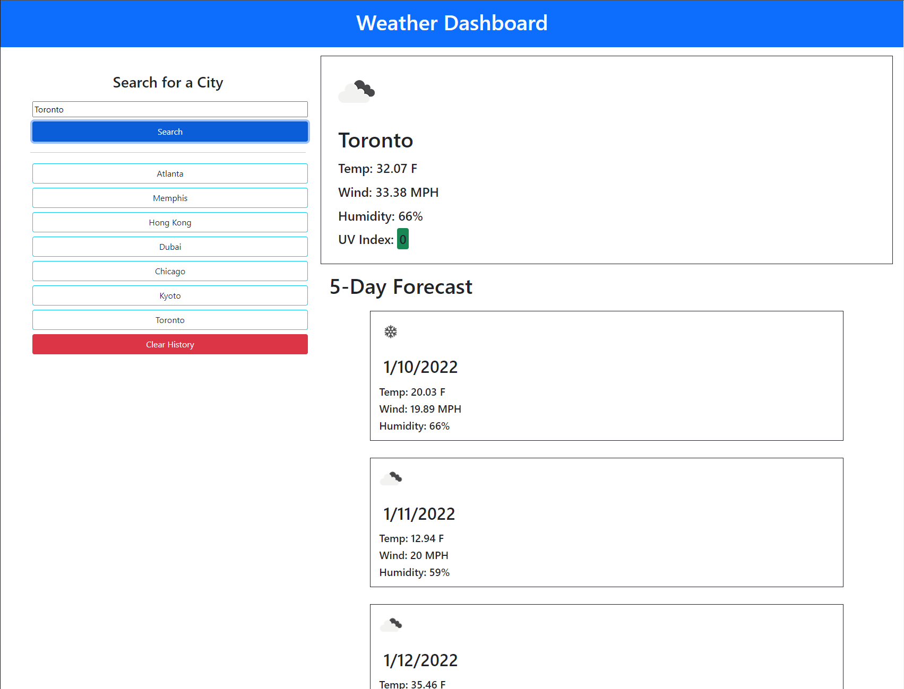

# Weather Dashboard

## Description

In this project, I made a Weather Dashboard. The user would enter a location into the text box click search, and then the weather for that location will appear on the page.

I made this project from blank files. I used HTML, Javascript, jQuery and Bootstrap for a clean and responsive look and feel.

This project also includes two APIs, both hosted by OpenWeather, which provides weather information based on a certain location. The first API is called One Call API, which provides weather for a location based on the latitude and longitude inputted. In order to get the coordinates, I used another API called Geocoding API, which provided the coordinates for a location.

This project was my most challenging yet, as it required two server-side API's in order to function. However, I found this project entertaining. There were many challenges while working on this project, such as GitHub pages not allowing the API to processes due to a content mix-up error, which required me to use a new API to get the coordinates. I also had to write several functions within functions. Overall, I felt like the project turned out well in the end.

**Link** 

GitHub Pages: https://johnclimie.github.io/WeatherDashboard/